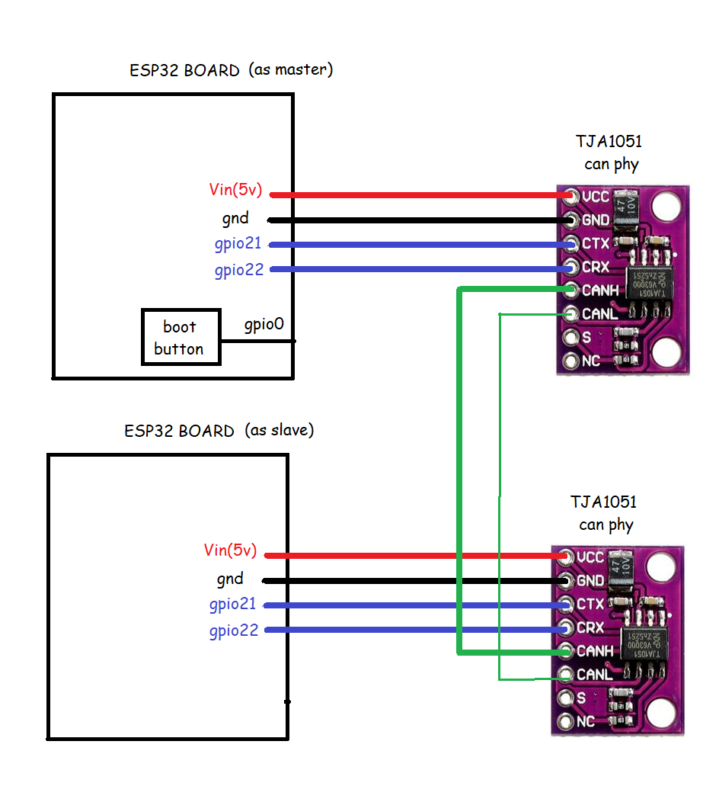

# ESP32 Can Bus(TWAI)
Base code for master and slave on an standalone can bus, usign esp32. Esp32 can bus works under 11898-1 standard.

## Details
* ESP32 board: esp32 wroom
* IDF version: 4.2.1
* Can PHY: TJA1051
* Application layer: none
* Physical and link layer: CAN

## Circuit


## How to use
* For both use the next steps:
```c
idf.py build
idf.py flash monitor -p COM18
```
* Then push the built-in boot button on the master side.
* You will get a reading, in the serial monitor, from the slave.

## How it works
* Every time the build-in button is pressed on master side, a standard can frame is pushed over the can bus.
* Our slave decive will receive it and send a response according to that.
* The master device will receive the answer and print all in the serial monitor.

## How to modify it
* The request from master device will be changed to TX_SEND_PINGS, TX_SEND_START_CMD(default) or TX_SEND_STOP_CMD.
* Modify gpio0 isr function:
```c
void gpio_isr(void *arg)
{
    tx_task_action_t action = TX_SEND_START_CMD;
    xQueueSendFromISR(tx_task_queue, &action, NULL);
}
```
* Compile, flash and open monitor for master device.

## Next steps
* Use filter function on standalone can.
* Add CanOPEN application layer to get standard behavior inside the can bus.
* Verify outgoing data with a logic probe.
